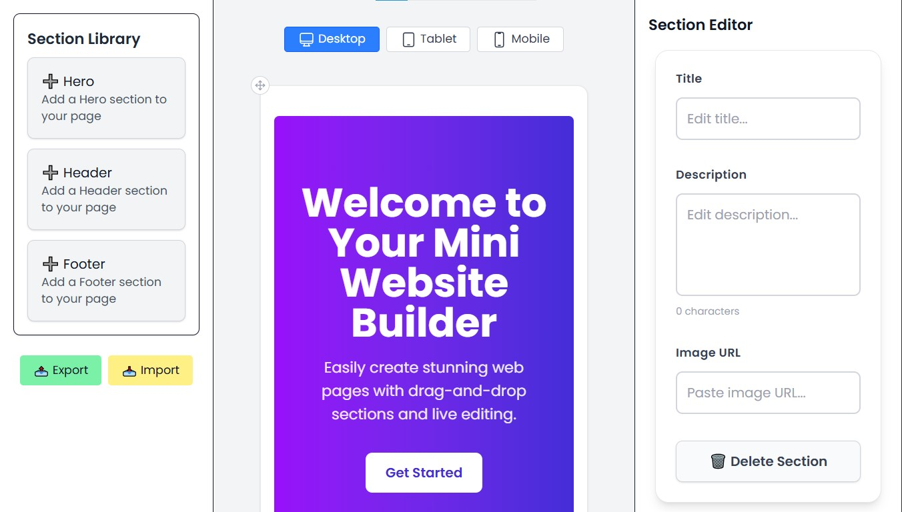
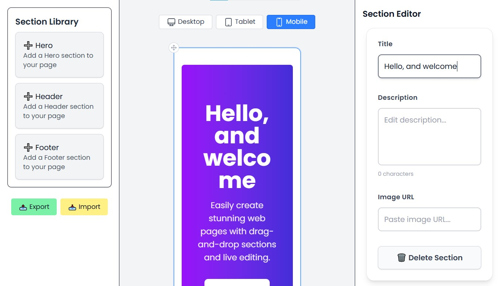

# 🎨 WebCanvas

[](https://nextjs.org/)
[](https://www.typescriptlang.org/)
[](https://tailwindcss.com/)

**WebCanvas** is a modern, drag-and-drop website builder powered by Next.js and TypeScript. Create, customize, and preview responsive websites with an intuitive interface. Perfect for developers and designers who want to quickly prototype landing pages or learn about building a drag-and-drop editor.

## Table of Contents

- [Features](#features)
- [Tech Stack](#tech-stack)
- [Quick Start](#quick-start)
- [Development](#development)
- [Project Structure](#project-structure-important-files)
- [Usage](#usage)
- [Screenshots](#screenshots)
- [Contributing](#contributing)
- [Contact](#contact)
- [License](#license)

## Features

- 🧩 **Drag & Drop Builder** – Intuitive interface to easily design layouts
- 📱 **Responsive Templates** – Build websites that look great on any device
- ⚙️ **Customizable Components** – Personalize every element to your liking
- 👀 **Real-Time Preview** – See your changes instantly as you edit
- 🔄 **Import/Export** – Save and reuse your sections across projects

## Tech Stack

- **Framework:** Next.js 15.4 (App Router)
- **Language:** TypeScript 5.0
- **Styling:** TailwindCSS 4.0
- **DnD:** @dnd-kit for drag & drop
- **UI:** Framer Motion, React Icons

## Quick start

  These commands assume you have Node.js (18+) and npm installed.

  1. Clone the repo

  ```bash
  git clone https://github.com/saeedhalabi/web-canvas.git
  cd web-canvas
  ```

  2. Install dependencies

  ```bash
  npm install
  ```

  3. Run the development server

  ```bash
  npm run dev
  ```

Open http://localhost:3000 in your browser.

4. Build for production

```bash
npm run build
npm run start
```

Visit http://localhost:3000 to view your production build.

5. Additional commands

```bash
# Run the linter
npm run lint

# Type checking
tsc --noEmit
```

## Development

  - [Features](#features)
  - [Tech stack](#tech-stack)
  - [Quick start](#quick-start)
  - [Development](#development)
  - [Project structure](#project-structure)
  - [Usage](#usage)
  - [Screenshots](#screenshots)
  - [Contributing](#contributing)

  ## Features

  - Drag & drop section builder (powered by @dnd-kit)
  - Responsive previews and simple section components
  - Real-time preview while editing
  - Export/import project sections

  ## Tech stack

  - Next.js (App Router)
  - React + TypeScript
  - Tailwind CSS
  - @dnd-kit for drag & drop

  
  ## Development

  - Components live in `components/` and reusable page sections are in `sections/`.
  - Global app logic and providers live in `context/` and `hooks/`.
  - Screenshots used in the README are in `screenshots/` (you can replace them).

  If you want to add a new section:

  1. Create a React/TSX component in `sections/` (follow existing examples: `Hero.tsx`, `Footer.tsx`).
  2. Export the section so it appears in the editor's library.
  3. Add any styles or assets to `public/` or the `components/` folder.

  ## Project structure (important files)

  - `app/` — Next.js App Router entry (pages/layouts)
  - `components/` — UI components and editor pieces
  - `sections/` — Reusable sections users can add to the canvas
  - `context/` — Builder context and provider
  - `hooks/` — Custom hooks (e.g., `useBuilder`)
  - `screenshots/` — Helpful preview images used in the README

  ## Usage (short)

  1. Open the app in the browser.
  2. Use the sidebar to browse sections and drag them onto the canvas.
  3. Click a section to edit its content (text, images, properties).
  4. Rearrange sections by dragging; use the preview switcher to see responsive views.

## Screenshots

### Builder Interface

*The main builder interface lets you drag sections, edit content, and arrange your page layout.*

### Responsive Preview

*Preview your design across mobile, tablet, and desktop views to ensure perfect responsiveness.*

## Contributing

  Contributions are welcome. A simple suggested workflow:

  1. Fork the repo and create a branch for your feature: `git checkout -b feat/my-feature`
  2. Make changes and run the dev server: `npm run dev`
  3. Commit and open a PR describing your change.


<div align="center">
  <p>Built with ❤️ by <a href="https://github.com/saeedhalabi">Saeed Halabi</a></p>
</div>
